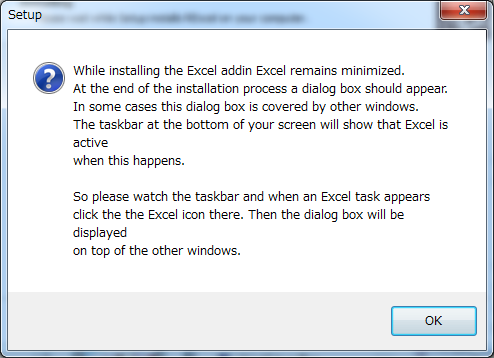

## RExcel

* RExcelはExcelでRの統計処理機能を呼び出す拡張パッケージです
* 個人利用であれば無料で利用できます
* ただしExcel本体は32Bit版を使う必要があります
* (Windows本体は64Bitでも問題ありません)

--- .class #id 

## インストール1

* まずはインストラーを <a href = "http://rcom.univie.ac.at/download.html" target=_blank>ここからダウンロード</a>します
* ここでRやExcelを起動しておく必要はありません
* ダウンロードしたらダブルクリックします
* 以降とにかく「OK」を押していきます。

--- .class #id 

## インストール2

--- .class #id 

## Full installationを選択

--- .class #id 

## さまざまな指示ダイアログ

* これはインストール完了直後にRでの操作を促すダイアログです(後述)

--- .class #id 

## 認証のインストール

--- .class #id 

## インストールを継続

--- .class #id 

## インストールを継続

--- .class #id 

## インストールを継続

--- .class #id 

## インストールを継続

--- .class #id 

## RExcelインストール手順を終了

* サポートはメーリングリストを利用しましょう

--- .class #id 

## Rでインストールを完了させる1

* RExcelをインストールしただけでは、まだ使えません
* R本体およびOSに拡張機能を追加します
* R(i386)を起動して以下のように入力してEnterを押します

     library (rcom)

--- .class #id 

## Rでインストールを完了させる2

* 続いて以下のように入力してEnterを押します
*  (入力途中でTABを押すと補完されます)

    installstatconnDCOM()

* ネットワーク越しにインストールが始まります
* 保存先を作成するか促された場合は「OK」を押しまう

--- .class #id 

## Rでインストールを完了させる3

--- .class #id 

## Excelを起動

* R はいったん終了させます
* Excelを起動します (例はExcel2010です)
* リボンの「アドイン」をクリックします
* 「Rexcel」をクリックしconnectRを選択
* Rが起動します(Rを操作する必要はありません)

操作方法については<a href = "http://www.amazon.co.jp/dp/4621061550" target = _blank>『ExcelでR自由自在』</a>を参照ください

--- .class #id 

## Excelを起動

