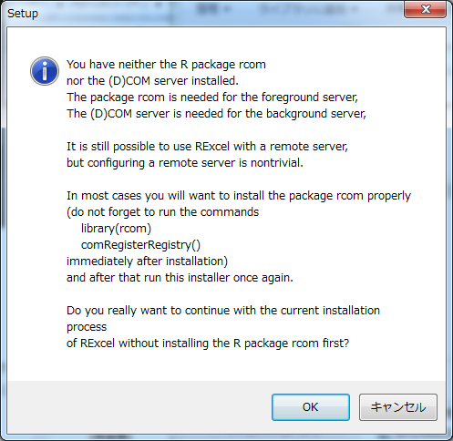
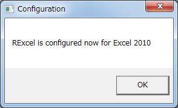
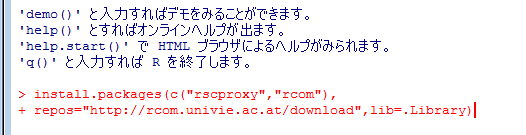

## RExcel

* RExcelはExcelでRの統計処理機能を呼び出す拡張パッケージです
* 個人利用であれば無料で利用できます
* ただしExcel本体は32Bit版を使う必要があります
* (Windows本体は64Bitでも問題ありません)

--- .class #id 

## インストール1

* まずはインストラー(RExcel 3.2.13)を <a href = "http://rcom.univie.ac.at/download.html" target=_blank>ここからダウンロード</a>します
* ここでRやExcelを起動しておく必要はありません
* ダウンロードしたらダブルクリックします
* 以降とにかく「OK」を押していきます。

--- .class #id 

## インストール2


--- .class #id 

## Full installationを選択


--- .class #id 

## さまざまな指示ダイアログ

* これはインストール完了直後にRでの操作を促すダイアログです(後述)




--- .class #id 

## 認証のインストール


--- .class #id 

## インストールを継続

* 途中に現われるダイアログが他のウィンドウに隠れてしまうことがあるので注意


--- .class #id 

## インストールを継続

* Excel2010では不具合が生じることがあるようです


--- .class #id 

## インストールを継続

* なおインストール手順は<a href = "http://homepage.univie.ac.at/erich.neuwirth/php/rcomwiki/doku.php?id=wiki:how_to_install" target=_blank>ここでも確認</a>できます


--- .class #id 

## インストールを継続

* Excelとのプラグインをインストールしています




--- .class #id 

## RExcelインストール手順を終了

* サポートは<a href="https://lists.univie.ac.at/mailman/listinfo/rcom-l" target=_blank>メーリングリストを利用</a>しましょう


* ただしRExcelをインストールしただけでは、まだ使えません
* もう少し作業を続けます

--- .class #id 

## Rでインストールを完了させる1


* R本体およびOSに拡張機能を追加します
* デスクトップのR(i386)アイコンを「右クリック」し「管理者として起動」


--- .class #id 

## Rでインストールを完了させる2

* Rコンソールに以下の通り入力してEnterを押します
* このインストール作業では、Rを管理者権限で実行している必要があります

```
install.packages(c("rscproxy","rcom"),
     repos="http://rcom.univie.ac.at/download",lib=.Library);
library(rcom);
comRegisterRegistry()
```




--- .class #id 

## Rでインストールを完了させる3

* 続いて以下のように入力してEnterを押します
* Rcmdrの不足しているパッケージを追加でインストールします

```
install.packages(c("Rcmdr","RcmdrPlugin.HH"),
   lib=.Library,dep=TRUE);
# Rcmdrの不足パッケージを追加
library(Rcmdr);#画面の指示に従ってインストール
# さらに以下を入力
install.packages(c("RcmdrPlugin.mosaic","ENmisc"),
   lib=.Library, dependencies=TRUE);
```


--- .class #id 

## Rでインストールを完了させる4

* さらに以下のように入力してEnterを押します
*  (入力途中でTABを押すと補完されます)

```
installstatconnDCOM()
```

* ネットワーク越しにインストールが始まります
* インストールが完了しましたのでR は終了します

--- .class #id 

## 「RExcel2010 with R」から起動する場合


* デスクトップの「RExcel2010 with R」アイコンを右クリック、管理者で実行
* (管理者で実行するのはインストール直後だけで、以降は普通にダブルクリックで起動して構いません)
* Rが背景で起動します(Rを操作する必要はありませんが閉じないでください)


--- .class #id 


## Excelを起動した後でRExcelを起動する場合


* リボンの「アドイン」をクリックします
* 「Rexcel」をクリックし「startR」を選択
* (すでにRを実行している場合は「connectR」を選択)
* RExcelアドインメニューから「startR」を実行した図


--- .class #id 


## ExcelにRmcdrメニューを追加

* RExcelアドインメニューから「RCommander」「with Excel menus」を選択
* アドインのリボンにRcommanderのメニューが追加されます


操作方法については<a href = "http://www.amazon.co.jp/dp/4621061550" target = _blank>『ExcelでR自由自在』</a>を参照ください


--- .class #id 


## 実行イメージ


